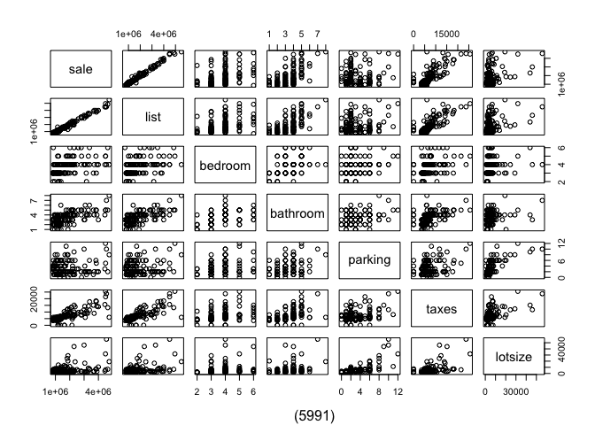
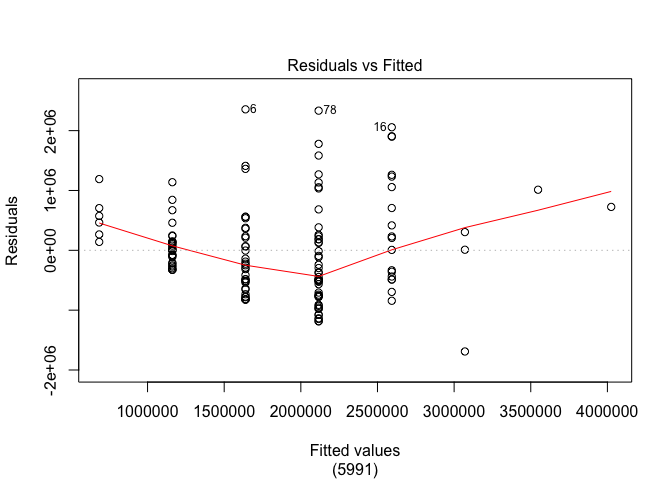
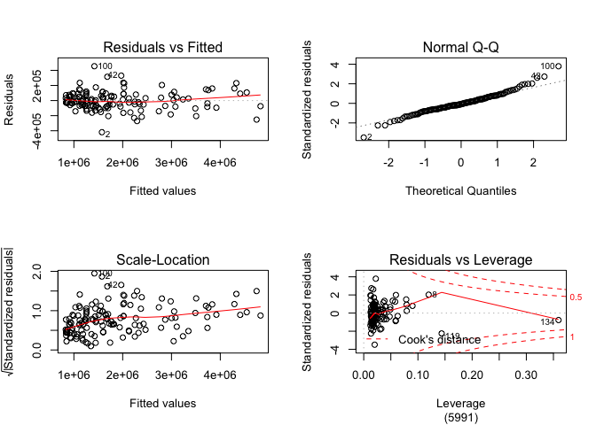

MLR Models for Sale Price of GTA Homes
================

## I. Data Wrangling

    ##   [1]  84 108 194  41  58 179 142 117  15 156  66  91 185 196 181  56  80 105
    ##  [19] 169 201  30 122 104  92  52  39 163 171 174 168 153  50 204 115   1   3
    ##  [37]  10  19 102 140 167  76  94  74  32 112  27  61  20  31 137  46 155 172
    ##  [55]  98  69 227 119  89  36  83  90 162  21 193  33 107 106 139 176 100 126
    ##  [73] 146 113  11 110  16   7 159  38 158 111 207  37 114  87  23  97   2 133
    ##  [91] 101  67 170 141 205  34 183  75  81 157  82 148 182 218  72 132 229  25
    ## [109]  96 154  45 180 173  88  71  49  63  79  47 147 134 186   8  99  55 151
    ## [127]  77   5 138  29 187   6 175 212 152 165  43  53 118 145 166  78  14 191
    ## [145]  24 189  22  35 190 177

We remove the maxsqfoot variable because for 87 of our 150 observations,
we don’t have this information. Similarly, we remove 10 additional data
points that have some missing value for at least one of the variables,
so we are able to perform stepwise regression later, which requires that
we don’t have missing values.

## II. Exploratory Data Analysis

Categorical Variables: location Discrete Variables: bedroom, bathroom,
parking Continous Variables: sale, list, taxes,
    lotsize

    ##               sale      list   bedroom  bathroom   parking     taxes   lotsize
    ## sale     1.0000000 0.9900191 0.4122802 0.6100317 0.1241357 0.7828867 0.3557500
    ## list     0.9900191 1.0000000 0.4094833 0.6236547 0.1633541 0.7674421 0.3707051
    ## bedroom  0.4122802 0.4094833 1.0000000 0.4882504 0.2552341 0.3535866 0.2109672
    ## bathroom 0.6100317 0.6236547 0.4882504 1.0000000 0.3113712 0.4999337 0.2931951
    ## parking  0.1241357 0.1633541 0.2552341 0.3113712 1.0000000 0.3448942 0.6981746
    ## taxes    0.7828867 0.7674421 0.3535866 0.4999337 0.3448942 1.0000000 0.5470531
    ## lotsize  0.3557500 0.3707051 0.2109672 0.2931951 0.6981746 0.5470531 1.0000000

<!-- -->

We see from the correlation matrix that the correlations between sale
price and each of the potential numeric predictors are from strongest to
weakest: list, taxes, bathroom, bedroom, lotsize, parking.

Of these potential predictors, we can see from the scatterplot matrix,
that because number of bathrooms is a discrete variable, the plot of
sale price against number of bathrooms has for each value of number of
bathrooms, multiple instances of homes with different sale prices. From
the plot, we can see that the spread of these instances for each value
of number of bathrooms does not appear to be constant. We can confirm
this by plotting the residuals against the fitted values for an SLR
model with number of bathrooms as the sole
predictor.

<!-- -->

## III. Methods and Model

    ##                  Estimate P_Value (5991)
    ## (Intercept)  5.929447e+04         0.2499
    ## list         8.360767e-01         0.0000
    ## taxes        1.986011e+01         0.0000
    ## bathroom     1.052518e+04         0.3931
    ## bedroom      1.230305e+04         0.3745
    ## lotsize      1.755627e+00         0.3910
    ## parking     -1.582698e+04         0.0456
    ## locationT    8.895781e+04         0.0142

For each of our predictor variables, if the corresponding p-value is
statistically significant, holding the other predictors constant, we
assume that as our predictor increases by one unit, our predicted mean
sale price would increase by the corresponding estimate.

We have that the final fitted model when backwards elimination is used
with AIC is:  
predicted mean sale price = 109177.5 + 0.8498292(list) + 20.60792(taxes)
+ -11204.72(parking) + 82851.77(location)  
and when BIC is used:  
predicted mean sale price = 66268.78 + 0.8438852(list) + 19.57671(taxes)
+ 123410.4(location),  
where location is a dummy variable equal to 1 when the location is
Toronto and 0 otherwise

All three of our considered models used a different set of predictor
variables. This is because we included all of our numeric variables in
our first model, but the latter two methods arrived at a smaller subset
in an attempt to prevent overfitting. This is also why our BIC model has
fewer predictor variables than our AIC model, as this method punishes
model complexity to a greater extent when we have this many data
points.

## IV. Discussions and Limitations

<!-- -->

We see from the first and third plots that we appear to have constant
error variance, as the residuals do not seem to exhibit some sort of
particular pattern. The residuals also trend the line in the normal Q-Q
plot quite well. In the last plot, we see that point 134 is a point of
high leverage, so this point can be investigated further.

The next step towards arriving at a valid model involves comparing the
three models we’ve fitted. There do not appear to be any violations of
the model assumptions for our BIC model, but we should check these
assumptions for our other two models as well. We can then assess the
effect of each predictor variable on sale price, given the effects of
the other predictor variables, with added variable plots and assess the
collinearity among the predictor variables with variance inflation
factors. Once we have our set of viable models, we can further compare
the adjusted R-squared and predictive abilities of each model to choose
the best one.
