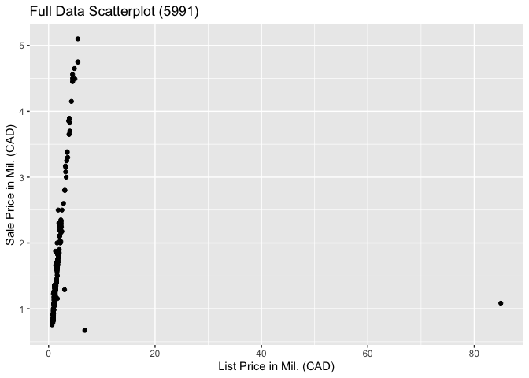
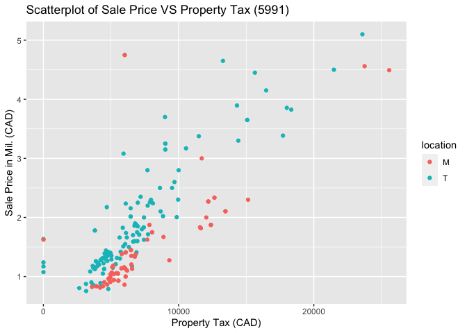
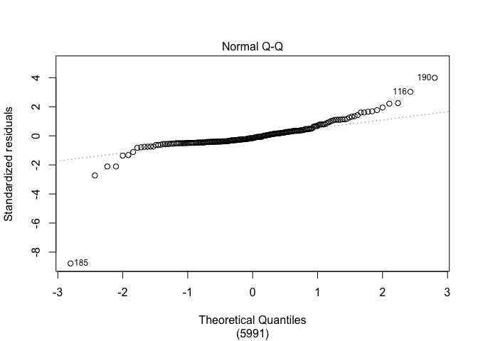
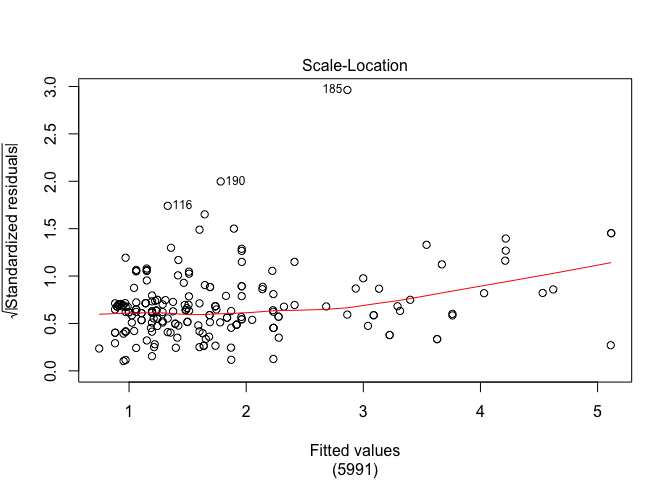

SLR Models for Sale Price of GTA Homes
================

## I. Exploratory Data Analysis

<!-- -->

Looking at the scatterplot, it becomes obvious that removing the two
points with a list price greater than 6 (mil.) would substantially
change the fit of any potential SLR model, as the rightmost point is an
especially influential
point.

<!-- --><!-- -->

The vast majority of data points from the full data scatterplot has been
condensed into a small subset of the x-axis, primarily due to an
influential point to the far right. The plot of sale price against list
price shows most of the data points adhering to the same straight line,
whereas the plot of sale price against property tax suggests that
separate SLR models would be more appropriate, one for Toronto and one
for
Mississauga.

## II. Methods and Model

|             |  RSquared | Intercepts |    Slopes | Res.Variance | P\_Values | Conf\_Ints                                |
| :---------- | --------: | ---------: | --------: | -----------: | :-------- | :---------------------------------------- |
| Both (5991) | 0.9631582 |  0.1601102 | 0.9012907 |    0.0325304 | \< 2e-16  | ( 0.876459549095063 , 0.926121805900599 ) |
| Toronto     | 0.9493252 |  0.1900078 | 0.9002073 |    0.0464865 | \< 2e-16  | ( 0.8614444329156 , 0.938970134225255 )   |
| Mississauga | 0.9851038 |  0.1463048 | 0.8852001 |    0.0110079 | \< 2e-16  | ( 0.861135367778609 , 0.909264774281827 ) |

All three values of RSquared appear relatively similar, only differing
by a few percent from each other. This suggests that all three models
are able to explain the variance of sale price using list price to a
similar degree. Because RSquared is large (\>0.9) for all three models,
this is one indication that the models are good predictors.

To carry out a pooled two-sample t-test, it’s required that both the
Toronto and Mississauga homes be independently sampled from two separate
normal distributions. This would also imply normality of the slopes. We
can check the normality requirement using normal Q-Q plots of the
standardized residuals. We assume independent samples given that we took
a simple random sample of the original dataset and we don’t know
anything more about how this dataset was obtained. However, we don’t
know if the distributions of the slopes have equal variance, so we
cannot perform a pooled two-sample t-test, as this is another
requirement.

## III. Discussions and Limitations

I believe the fitted model that includes both Toronto and Mississauga
homes is most appropriate based on the table shown in Section II. There
don’t appear to be any significant differences between the values of
RSquared, intercept estimates, or slope estimates for all three models.
Thus, there’s no reason to treat the Toronto and Mississauga homes as
two separate populations for the purposes of an SLR model with list
price as the explanatory
variable.

<!-- --><!-- -->

We can see from the Q-Q plot that the data points fall close to the
dotted line for most of the values, but the points seem to taper off
towards the ends, suggesting the standardized residuals follow a T
distribution rather than the normal distribution required for SLR. From
the Scale-Location plot, we can see that the variability of the
standardized residuals remains relatively constant before steadily
increasing until the last data point. This suggests that we also don’t
have the required assumption of constant variance of the errors.

Two additional potential numeric explanatory variables we could use to
fit a multiple linear regression model for sale price are average sale
price of surrounding homes and size in square feet.
